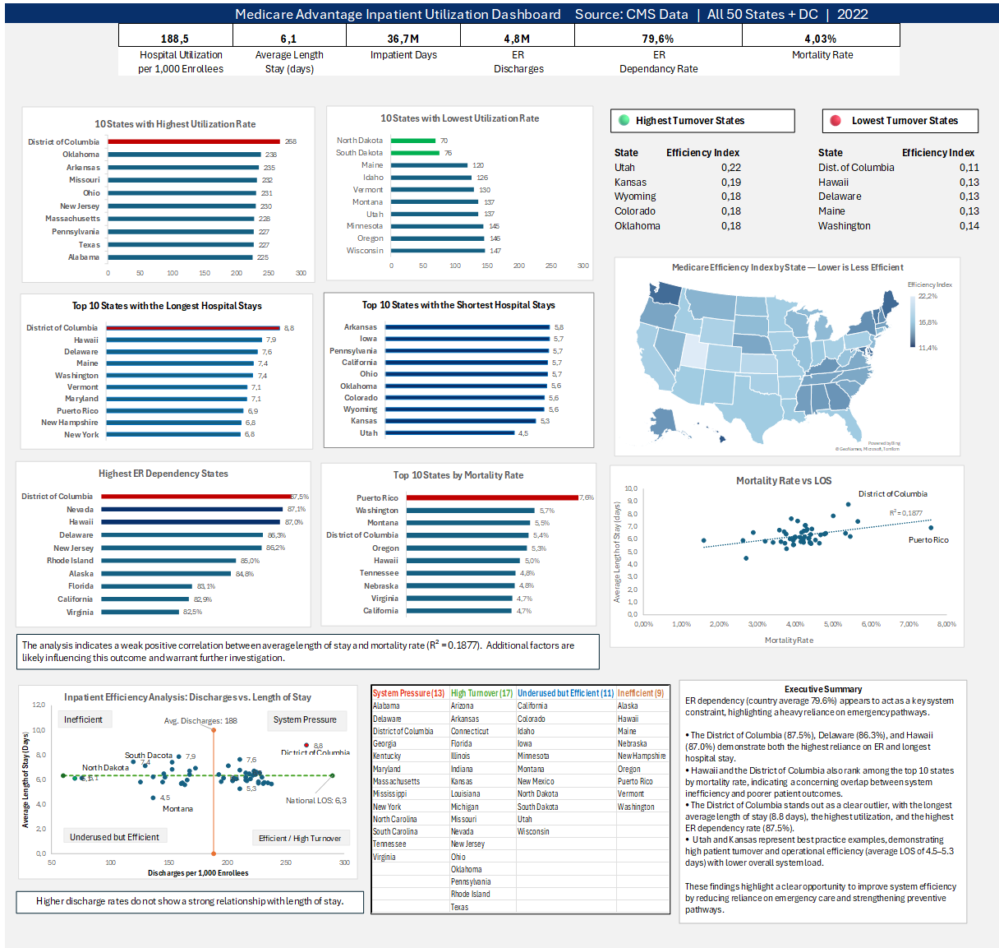

# 🏥 Medicare Advantage Inpatient Utilization Analysis (2022)

## 📌 Project Overview
An analytical project evaluating hospital operational efficiency, patient turnover, and emergency room utilization across all 50 U.S. states and the District of Columbia. The project uses administrative enrollment and real encounter records obtained from the Centers for Medicare & Medicaid Services (CMS).

The primary dataset used for this analysis is: 
* **Dataset Name:** `All Medicare Inpatient Hospitals: Utilization for Medicare Advantage Beneficiaries, by Type of Hospital, Calendar Year 2022` (Table `MDCR INPT HOSP 4_CPS_13UMI`).
* **Source:** Centers for Medicare & Medicaid Services (CMS), Office of Enterprise Data and Analytics.

## 📊 Dashboard View

---

## 📈 Executive Summary

- **System Constraints:** Higher utilization is primarily driven by the **ER Dependency Rate** (country average 79.6%) rather than prolonged treatment.
- **System Pressure & Risk Areas:** States with the highest ER dependency rates (*District of Columbia* 87.5%, *Hawaii* 87.0%, and *Delaware* 86.3%) show the longest average lengths of stay (LOS) and rank lowest in operational efficiency.
- **Best Practices:** *Utah* and *Kansas* demonstrate high turnover and efficiency with an average length of stay of **4.5–5.3 days** and a lower overall system load.

---

## 🛠️ Methodology & Metrics

The analysis evaluates bed turnover and operational performance by developing an **Efficiency Score** using the following formula:

$$\text{Efficiency Score} = \frac{\text{Discharges} \times 100}{\text{Total Days}}$$

- **High Efficiency (0.18 - 0.22):** Short stays and high turnover.
- **Low Efficiency (< 0.12):** Prolonged patient stays that strain systemic capacity.

### Data Source Methodology
- **Scope:** The data is based on real inpatient hospital encounter records submitted by Medicare Advantage Organizations to CMS.
- **Categorization:** An algorithm was applied to categorize inpatient hospital encounter records by hospital type consistent with fee-for-service hospital categorization.

---

## 📂 Project Structure

- `Medicare_Dashboard.xlsx` — Excel dashboard containing all data and visualizations.
- `Dashboard.png` — Visual overview of the dashboard.
- `README.md` — Project documentation.
- `CPS_Methodology_v2.pdf` — CMS Program Statistics Methodological Overview.
